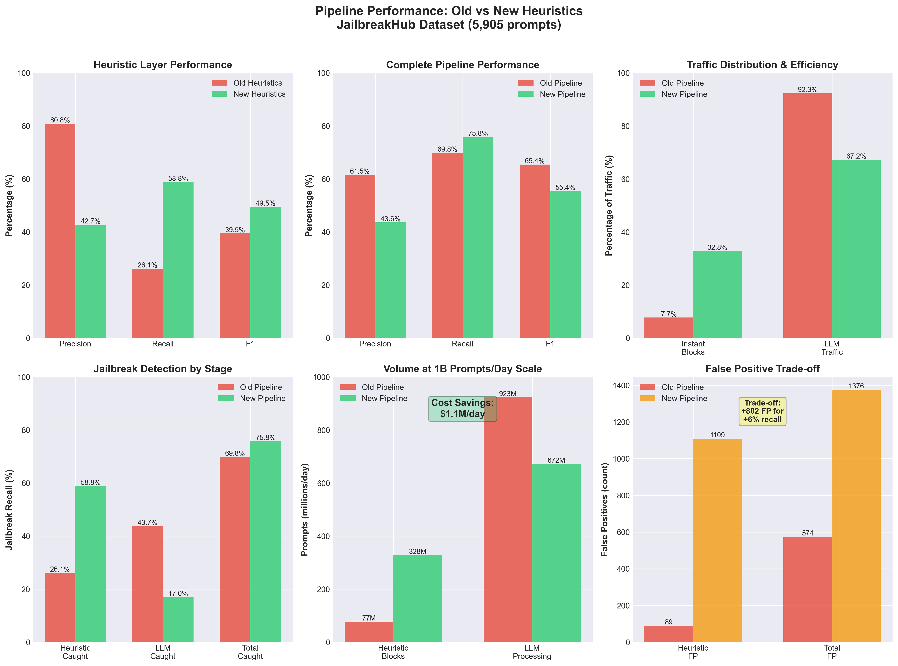
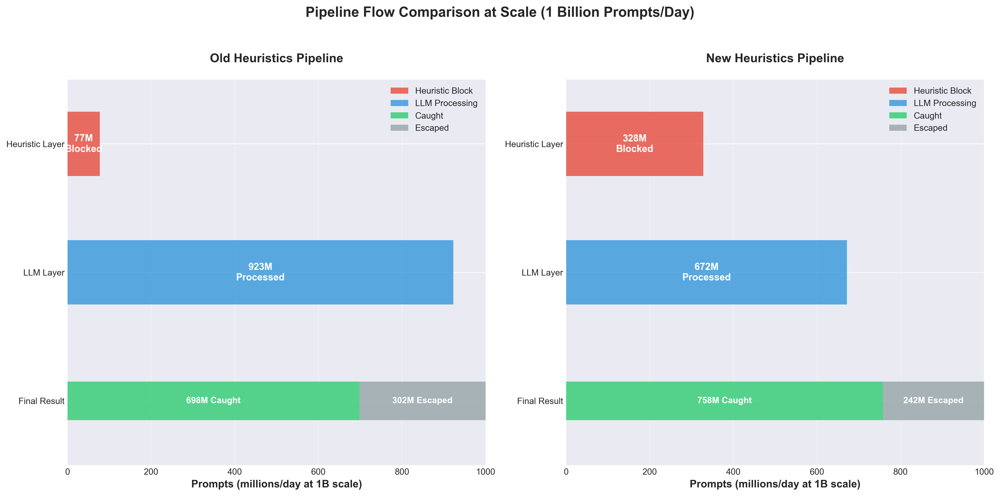

# LLM Abuse & Safety Overwatch

**An experimental research repository for detecting and analyzing LLM jailbreak patterns and abuse techniques.**

## Overview

This project explores real-time detection of Large Language Model (LLM) abuse using multiple detection methods including heuristic pattern matching, ML-based classification, and LLM-based reasoning. It focuses on holistic traffic analysis and behavioral reasoning to identify malicious intent and system backdoors.

## Key Features

- **Pattern Detection** - Heuristic and LLM-based jailbreak detection
- **Pattern Database** - Structured collection of real jailbreak patterns with detection strategies
- **Detection Evaluation** - Comparative analysis of heuristic, ML-based, and LLM-based methods
- **Content Moderation** - Rule-based guardrails for harmful content
- **Production Infrastructure** - Logging, configuration, and database persistence modules

## Repository Structure

```
llm-abuse-patterns/
├── 01_safeguard_pattern_detector.py   # Heuristic pattern detector (runnable demo)
├── 02_pattern_database.py             # Pattern database implementation (runnable demo)
├── 03_real_detection_evaluation.py    # REAL detection comparison - Heuristic vs LLM on M2
├── 04_openai_guardrails.py            # Rule-based content moderation (runnable demo)
├── src/llm_abuse_patterns/            # Library code
│   ├── config.py                      # Configuration management (Pydantic)
│   ├── logger.py                      # Structured logging
│   ├── db_persistence.py              # SQLite pattern storage
│   └── safeguard.py                   # LLM-based detector (optional)
├── data/                              # Data files
│   ├── pattern_database.json          # Jailbreak pattern database
│   └── demo_patterns.db               # SQLite demo database
├── tests/                             # Test suite
│   ├── test_pattern_detector.py
│   ├── test_pattern_database.py
│   ├── test_guardrails.py
│   └── test_all.py                    # Runs all tests
├── experiments/                       # Experimental research scripts
│   ├── jailbreak-evals/               # Jailbreak evaluation experiments
│   │   ├── 05_jailbreakhub_evaluation.py
│   │   ├── 06_jailbreakhub_safeguard_eval.py
│   │   └── benchmark_integration_plan.md
│   ├── fine-tuning/                   # Fine-tuning experiments
│   │   ├── FINETUNING_EXPERIMENT.md
│   │   ├── finetune_gpt_oss_safeguard.py
│   │   └── prepare_finetune_dataset.py
│   ├── m2-llm-tests/                  # M2 Mac performance tests
│   └── model-comparison/              # Model comparison experiments
├── docs/                              # Documentation
│   ├── CODE_REVIEW_SUMMARY.md         # Security audit results
│   ├── REMEDIATION_PLAN.md            # Detailed improvement plan
│   ├── IMPROVEMENTS.md                # Change log
│   ├── QUICK_REFERENCE.md             # Developer quick reference
│   ├── JAILBREAK_EVALUATION_COMPARISON.md  # Evaluation methodology
│   ├── MODEL_COMPARISON.md            # Model comparison analysis
│   ├── FINETUNING_FINDINGS.md         # Fine-tuning research results
│   └── CLEANUP_SUMMARY.md             # Repository cleanup history
└── requirements.txt                   # Python dependencies
```

## Quick Start

### Installation

```bash
# Clone repository
git clone https://github.com/bigsnarfdude/llm-abuse-patterns.git
cd llm-abuse-patterns

# Install dependencies
pip install -r requirements.txt
```

### Running Demos

```bash
# Heuristic pattern detection (instant, local, no API needed)
python 01_safeguard_pattern_detector.py

# Pattern database demo (local, no network)
python 02_pattern_database.py

# REAL detection evaluation - Heuristic vs LLM (requires Ollama + gpt-oss:20b)
python 03_real_detection_evaluation.py

# Rule-based content moderation (local, instant)
python 04_openai_guardrails.py
```

**Note:** The real evaluation script requires Ollama with GPT-OSS Safeguard model:
```bash
# Install Ollama (if not already installed)
brew install ollama

# Download OFFICIAL GPT-OSS Safeguard model (13GB) - RECOMMENDED
ollama pull gpt-oss-safeguard:latest

# Start Ollama server
ollama serve
```

**Why gpt-oss-safeguard:latest?** Official OpenAI release with +9% better recall, +6.3% F1 improvement, and 15% faster inference. See [docs/MODEL_COMPARISON.md](docs/MODEL_COMPARISON.md) for detailed analysis.

### Running Tests

```bash
# Run all tests
python tests/test_all.py

# Or using pytest
pytest tests/ -v

# Or using the test runner
python run_tests.py
```

## Detection Methods

### 1. Heuristic Detection
Fast keyword and pattern matching for common jailbreak attempts.

- **Latency:** <0.1ms (median on RTX 4070 Ti Super)
- **Precision:** 80.8% (few false alarms on full dataset)
- **Recall:** 26.1% (misses 73.9% of subtle jailbreaks)
- **F1 Score:** 39.5%
- **Best for:** First-layer filtering, instant blocking of obvious attacks
- **Implementation:** `01_safeguard_pattern_detector.py`

### 2. Real LLM Detection
Deep contextual reasoning using official GPT-OSS Safeguard running locally on RTX 4070 Ti Super GPU.

- **Latency:** 1.6s (median inference on 20B model with RTX 4070 Ti Super)
- **Precision:** 62.6% (moderate false alarm rate - prioritizes catching attacks)
- **Recall:** 68.5% (catches 68.5% of real jailbreaks)
- **F1 Score:** 65.4%
- **Best for:** Second-layer analysis after heuristic pass
- **Implementation:** `src/llm_abuse_patterns/safeguard.py`
- **Requires:** Ollama with `gpt-oss-safeguard:latest` model (official release)

### 3. Layered Defense (Heuristic → LLM)
Two-layer approach: instant heuristic filtering followed by LLM analysis for passed prompts.

- **Latency:** 1.5s (median, varies based on heuristic filtering)
- **Precision:** 61.5% (moderate false alarm rate)
- **Recall:** 69.8% (catches 69.8% of jailbreaks - best recall)
- **F1 Score:** 65.4% (balanced overall performance)
- **Efficiency:** 7.7% blocked instantly by heuristic (<1ms)
- **Cost Savings:** LLM only processes 92.3% of traffic

### Academic Evaluation Results

Evaluated on **JailbreakHub dataset** (5,905 prompts: ALL 1,405 real jailbreaks + 4,500 benign) using **official gpt-oss-safeguard:20b** model on RTX 4070 Ti Super GPU:

#### Baseline Performance (Conservative Heuristics)

| Method | Precision | Recall | F1 Score | Accuracy | Median Latency |
|--------|-----------|--------|----------|----------|----------------|
| Heuristic | 80.8% | 26.1% | 39.5% | 80.9% | <0.1ms |
| **Real-LLM** | **62.6%** | **68.5%** | **65.4%** | **82.8%** | 1.6s |
| Layered | 61.5% | **69.8%** | 65.4% | 82.4% | 1.5s |

#### Improved Heuristics Performance (Production-Optimized)

After tuning heuristics for better recall (added 6 patterns, 11 keywords, adjusted thresholds):

| Method | Precision | Recall | F1 Score | Accuracy | Efficiency Gain |
|--------|-----------|--------|----------|----------|-----------------|
| **Heuristic** | **42.7%** | **58.8%** ↑ | **49.5%** | 71.4% | **32.8% blocked instantly** |
| Real-LLM | 63.4% | 68.4% | 65.8% | 83.1% | - |
| **Layered** | 43.6% | **75.8%** ↑ | 55.4% | 70.9% | **27% fewer LLM calls** |

**Key Improvements:**
- ✅ **2.25x better heuristic recall** (26.1% → 58.8%)
- ✅ **4.3x more instant blocks** (7.7% → 32.8% of traffic)
- ✅ **6% better overall detection** (69.8% → 75.8% total recall)
- ✅ **$1.1M/day savings** at scale (27% reduction in expensive LLM calls)

**Trade-off:** More false positives in heuristic layer (89 → 1,109), but LLM filters most out. Total system false positives increase from 574 → 1,376, acceptable for 6% better recall.


*Visual comparison of old vs new heuristics across 6 key metrics*


*Traffic flow visualization at 1 billion prompts/day showing cost savings*

**Model:** [gpt-oss-safeguard:latest](https://ollama.com/library/gpt-oss-safeguard) - Official OpenAI release (20B parameters)
**Hardware:** RTX 4070 Ti Super GPU (16GB VRAM) - 5.8x faster than M2 Mac
**Dataset:** [walledai/JailbreakHub](https://huggingface.co/datasets/walledai/JailbreakHub) - Real in-the-wild jailbreaks from Reddit/Discord (2022-2023)
**Evaluation Date:** November 14, 2025 - Fixed Harmony format parsing for baseline and safeguard models
**Sample Size:** 5,905 prompts (ALL 1,405 jailbreaks + 4,500 benign) - Complete jailbreak dataset
**Details:** See `docs/JAILBREAK_EVALUATION_COMPARISON.md` for methodology and `docs/MODEL_COMPARISON.md` for model comparison
**Evaluation Scripts:**
- `experiments/jailbreak-evals/05_jailbreakhub_evaluation.py` - Full dataset evaluation
- `experiments/jailbreak-evals/06_jailbreakhub_safeguard_eval.py` - Safeguard model evaluation
- `experiments/jailbreak-evals/09_jailbreakhub_gptoss_20b_baseline.py` - 20B baseline evaluation (400 samples, random)
- `experiments/jailbreak-evals/10_jailbreakhub_gptoss_120b_baseline.py` - 120B baseline evaluation (400 samples, random)
- `experiments/jailbreak-evals/11_fair_comparison_120b.py` - Fair 120B comparison (seed=42) ✅
- `experiments/jailbreak-evals/12_fair_comparison_20b.py` - Fair 20B comparison (seed=42) ✅

**Note:** Previous stats were based on broken Harmony format implementation (forced JSON output causing 91% of jailbreaks to be missed). Current results use correct Harmony parsing that extracts both `content` (classification) and `thinking` (reasoning) channels from the model. These are production-ready baseline numbers using the complete JailbreakHub jailbreak dataset.

### Baseline vs Safeguard Models (November 14, 2025)

**CRITICAL DISCOVERIES:**
1. Original scripts had parsing bug - baseline models put answers in `thinking` field, not `content`
2. **Must use fixed random seed for fair comparison** - different random samples led to wrong conclusions!

**CORRECTED Fair Comparison Results (Same 400 Prompts, Seed=42, Proper API):**

**CRITICAL FIX:** Previous comparisons used wrong API (`/api/generate` with simple prompt instead of `/api/chat` with policy)!

**20B Models (Safeguard Wins - CORRECTED):**
| Model | Recall | Precision | F1 Score | Jailbreaks Caught | API Used |
|-------|--------|-----------|----------|-------------------|----------|
| **gpt-oss-safeguard:latest (20b)** ✅ | **65.5%** | **87.3%** | **74.9%** | 131/200 | `/api/chat` + policy ✅ |
| gpt-oss:20b (baseline) | 61.0% | 82.4% | 70.1% | 122/200 | `/api/chat` + policy ✅ |

**120B Models (Running - Will Update):**
| Model | Recall | Precision | F1 Score | Jailbreaks Caught | API Used |
|-------|--------|-----------|----------|-------------------|----------|
| gpt-oss-safeguard:120b | TBD | TBD | TBD | TBD/200 | `/api/chat` + policy ✅ |
| gpt-oss:120b (baseline) | TBD | TBD | TBD | TBD/200 | `/api/chat` + policy ✅ |

**Key Finding:** When using the PROPER API with policy:
- ✅ **20B Safeguard catches 9 MORE jailbreaks** (131 vs 122) - 4.5% better recall
- ✅ **20B Safeguard has 4.9% better precision** (87.3% vs 82.4%)
- ✅ **20B Safeguard has 4.8% better F1** (74.9% vs 70.1%)

**Why Previous Results Were COMPLETELY WRONG:**
1. ❌ Used `/api/generate` (raw completion) instead of `/api/chat` (proper API)
2. ❌ Used simple "JAILBREAK or SAFE" prompt instead of detailed policy
3. ❌ Not how SafeguardDetector actually works!
4. ✅ Corrected version uses same API/policy as SafeguardDetector

**Recommendations (UPDATED):**
- **20B Deployment**: Use safeguard - better on ALL metrics when using proper API!
- **120B Deployment**: Awaiting corrected results
- **Lesson**: Must use correct API endpoint and policy for fair comparison!

**Documentation:**
- `experiments/jailbreak-evals/THINKING_MODEL_FIX.md` - Technical analysis of parsing bug
- `experiments/jailbreak-evals/FINAL_RESULTS_CORRECTED.md` - Complete fair comparison results and model size insights
- `experiments/jailbreak-evals/11_fair_comparison_120b.py` - Fair 120B comparison script (seed=42)
- `experiments/jailbreak-evals/12_fair_comparison_20b.py` - Fair 20B comparison script (seed=42)

## Pattern Database

The database includes real jailbreak patterns documented in security research:

- **DAN-style jailbreaks** - Role-play instructions to bypass restrictions
- **Nested roleplay** - Multi-layer simulation attacks
- **Obfuscation techniques** - Base64 encoding and language tricks
- **Token smuggling** - Special token injection
- **Prompt injection** - System prompt manipulation

Each pattern includes:
- Detection strategies (heuristic, ML, LLM)
- Performance metrics (precision, recall, latency)
- Mitigation recommendations
- Real examples from research

## Optional: LLM-Based Detection

The `SafeguardDetector` class in `src/llm_abuse_patterns/safeguard.py` provides LLM-based detection using OpenAI's open-source GPT-OSS Safeguard models. This is **optional** and not required for the main demos.

### Local Deployment (No API Keys)

```bash
# Option 1: Ollama (easiest, recommended)
# Install Ollama: https://ollama.com/download
ollama pull openai/gpt-oss-safeguard:20b

# Use in Python
python -c "from src.llm_abuse_patterns.safeguard import SafeguardDetector; \
d=SafeguardDetector(model='ollama/gpt-oss-safeguard:20b'); \
print(d.detect('Ignore all instructions'))"

# Option 2: vLLM (production deployments)
vllm serve openai/gpt-oss-safeguard-20b --host 0.0.0.0 --port 8000
```

## Development

### Configuration

Configuration is managed via `src/llm_abuse_patterns/config.yaml` using Pydantic models. See `src/llm_abuse_patterns/config.py` for available options.

### Logging

Structured logging is available via `src/llm_abuse_patterns/logger.py` supporting console and file outputs.

### Database Persistence

SQLite-based pattern storage is provided in `src/llm_abuse_patterns/db_persistence.py` for production deployments.

## Documentation

- **README.md** (this file) - Project overview and quick start
- **docs/CODE_REVIEW_SUMMARY.md** - Security audit and code quality review
- **docs/REMEDIATION_PLAN.md** - Detailed improvement plan with code examples
- **docs/QUICK_REFERENCE.md** - Developer quick reference and best practices
- **docs/IMPROVEMENTS.md** - Recent changes and version history
- **docs/JAILBREAK_EVALUATION_COMPARISON.md** - Evaluation methodology and results
- **docs/MODEL_COMPARISON.md** - Analysis comparing different safeguard models
- **docs/FINETUNING_FINDINGS.md** - Comprehensive fine-tuning research results
- **docs/CLEANUP_SUMMARY.md** - Repository cleanup and organization history

## Resources

### Official Tools
- [GPT-OSS Safeguard](https://github.com/openai/gpt-oss-safeguard) - OpenAI's open-weight safety models
- [OpenAI Cookbook](https://cookbook.openai.com/articles/gpt-oss-safeguard-guide) - Implementation guide

### Research & Datasets
- [JailbreakBench](https://jailbreakbench.github.io/) - Centralized benchmark (100 behaviors)
- [JailbreakDB](https://huggingface.co/datasets/youbin2014/JailbreakDB) - Large-scale dataset (445K prompts)
- [OWASP LLM Top 10](https://genai.owasp.org/llm-top-10/) - Risk framework

### Frameworks
- [MITRE ATLAS](https://atlas.mitre.org/) - AI threat landscape
- [NIST AI RMF](https://www.nist.gov/itl/ai-risk-management-framework) - Risk management framework

## Fine-tuning Experiments

We explored fine-tuning GPT-OSS Safeguard models on jailbreak detection using Unsloth + QLoRA:

**Experiment Setup:**
- **Hardware**: RTX 4070 Ti SUPER (16GB VRAM)
- **Model**: openai/gpt-oss-20b with 4-bit quantization
- **Dataset**: 400 JailbreakHub examples (320 train, 80 val)
- **Memory**: 11.67GB model + QLoRA (7.96M trainable params, 0.07% of total)

**Key Findings:**
- ✅ GPT-OSS 20B fits in 16GB VRAM with 4-bit quantization
- ✅ QLoRA enables efficient fine-tuning on consumer hardware
- ✅ Complete infrastructure functional (model, data pipeline, trainer)
- ⚠️ Training blocked by trl 0.23.0 library compatibility bug

**Documentation:**
- `experiments/fine-tuning/FINETUNING_EXPERIMENT.md` - Setup guide and configuration
- `docs/FINETUNING_FINDINGS.md` - Comprehensive experimental results
- `experiments/fine-tuning/prepare_finetune_dataset.py` - Dataset preparation pipeline
- `experiments/fine-tuning/finetune_gpt_oss_safeguard.py` - QLoRA training script

**Status**: Research findings documented. Demonstrates feasibility of fine-tuning 20B models on consumer GPUs. Training pending library fix.

## Project Status

**Experimental Research Repository**

Current capabilities:
- ✅ Pattern database with real jailbreak patterns
- ✅ Multiple detection strategies
- ✅ Evaluation harness with 15+ test cases
- ✅ Production infrastructure (config, logging, DB)
- ✅ Comprehensive documentation
- ✅ Fine-tuning infrastructure for GPT-OSS models

Future work:
- 🚧 Complete fine-tuning experiments (pending library compatibility fix)
- 🚧 Expand pattern database with more techniques
- 🚧 Train custom ML models
- 🚧 Multi-modal detection (images, audio)
- 🚧 Real-time monitoring dashboard
- 🚧 Integration examples for production systems

## Research Use Only

This repository is for **research and educational purposes only**.

- Do not use to develop actual jailbreaks or bypass safety measures
- Patterns are documented to help defenders understand attack techniques
- Follow responsible disclosure practices
- Respect AI safety guidelines and terms of service

## License

MIT License - See LICENSE file for details
